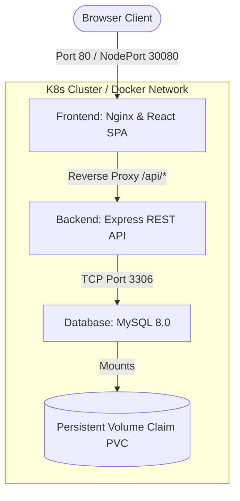

# EMS — Enterprise Employee Management System

A production-style, three-tier Employee Management System featuring a glassmorphic dashboard panel, built with **React**, **Tailwind CSS**, **Node.js/Express**, and **MySQL**. The application is containerized with **Docker** and orchestrated using **Kubernetes**, designed for high availability and dynamic horizontal scaling.

---

## 🏗️ System Architecture

The application implements a clean three-tier architecture with network segregation:



### Architectural Decisions:
1. **Nginx Reverse Proxy:** To secure frontend-backend communication and prevent CORS errors, the frontend container runs an Nginx server. Nginx acts as a reverse proxy, catching any `/api/*` traffic and forwarding it internally to `http://backend:5000/api/*`.
2. **Database Persistence:** MySQL data is mounted to a volume (Docker volume in Compose / PVC in Kubernetes) ensuring data survives container crashes or pod rescheduling.
3. **Configuration Decoupling:** Environment settings and secrets are separated from the codebase using system variables, ConfigMaps, and Kubernetes Secrets.

---


## 📂 Project Structure

```text
employee-management-system/
├── backend/
│   ├── config/          # Database connection pooling
│   ├── controllers/     # Route request handlers & validation logic
│   ├── middleware/      # Centralized HTTP error handler
│   ├── models/          # SQL queries matching MVC model tier
│   ├── routes/          # REST route declarations
│   ├── Dockerfile       # Node.js Alpine build definition
│   └── server.js        # Server bootstrapping entry point
├── database/
│   └── schema.sql       # Database table creation & Seed data
├── frontend/
│   ├── nginx.conf       # SPA redirects and API reverse proxy routes
│   ├── src/
│   │   ├── components/  # Reusable Form, Table, Loading, and Error components
│   │   ├── pages/       # Dashboard and Registry pages
│   │   └── services/    # Axios client wrapper
│   ├── Dockerfile       # Multi-stage production Nginx build
│   └── tailwind.config.js
├── kubernetes/          # K8s manifest files
│   ├── namespace.yaml
│   ├── configmap.yaml
│   ├── secrets.yaml
│   ├── mysql-pvc.yaml
│   ├── mysql-initdb-config.yaml
│   ├── mysql-deployment.yaml
│   ├── mysql-service.yaml
│   ├── backend-deployment.yaml
│   ├── backend-service.yaml
│   ├── frontend-deployment.yaml
│   └── frontend-service.yaml
└── docker-compose.yml   # Multi-container startup orchestration
```

---

## 🚀 Setup & Launch Instructions

### Option 1: Multi-Container Launch via Docker Compose (Easiest)

Ensure you have Docker Desktop running.

1. **Spin up the stack**:
   ```bash
   docker compose up --build -d
   ```
   *This automatically builds the frontend/backend images, boots up MySQL, runs the schema initialization, and mounts all networks.*

2. **Access the application**:
   - Web Dashboard: [http://localhost](http://localhost) (Port 80)
   - Backend API status: [http://localhost:5000/health](http://localhost:5000/health)

3. **Verify running containers**:
   ```bash
   docker ps
   ```

4. **Shutdown the stack**:
   ```bash
   docker compose down -v
   ```

---

### Option 2: Kubernetes Deployment (Docker Desktop / Minikube)

Ensure Kubernetes is enabled in your Docker Desktop settings.

1. **Tag your local images** so Kubernetes' local registry can resolve them:
   ```bash
   docker tag employee-management-system-backend:latest ems-express-backend:latest
   docker tag employee-management-system-frontend:latest ems-react-frontend:latest
   ```

2. **Create the namespace**:
   ```bash
   kubectl apply -f kubernetes/namespace.yaml
   ```

3. **Apply the remaining configurations**:
   ```bash
   kubectl apply -f kubernetes/
   ```

4. **Verify running pods**:
   ```bash
   kubectl get pods -n ems
   ```
   *(Wait for status to become `Running`)*

5. **Expose the Web UI NodePort service**:
   - Access the dashboard at: `http://localhost:30080` (mapped to port 80 inside the container).

---

## 🛠️ DevOps Demonstration Guide (LinkedIn & Portfolio Ready)

### 1. Self-Healing Demonstration
Simulate a server crash by killing a running backend pod. Observe how Kubernetes instantly repairs itself:
```bash
# Get current pod names
kubectl get pods -n ems

# Delete one of the backend pods
kubectl delete pod <backend-pod-name> -n ems

# Instantly watch the pod list
kubectl get pods -n ems
```
> [!NOTE]
> You will notice the deleted pod status becomes `Terminating` while a brand-new backend pod is automatically spawned to maintain the replica threshold.

### 2. Horizontal Scaling Demonstration
Scale the backend dynamically to handle simulated high traffic spikes:
```bash
# Scale the backend deployment to 4 replicas
kubectl scale deployment backend --replicas=4 -n ems

# Verify scaling
kubectl get pods -n ems
```

---

## 🔧 Real-World Troubleshooting (What I Solved)

Documenting how conflicts were resolved demonstrates genuine problem-solving engineering skills:

*   **Port Bind Conflicts (TCP 3306):** A local MySQL server was already listening on port `3306` on the host machine. To resolve this, `docker-compose.yml` was configured to map external port `3307` to container port `3306`. Internal container traffic remained unaffected while host conflicts were avoided.
*   **Vite 8 Node Engine Crashes:** Vite 8 requires Node.js `^20.19.0` or `>=22.12.0`. Initial Dockerfiles using Node 18 crashed on missing native global constructors (like `CustomEvent`). Upgrading the Docker builder images to `node:22-alpine` resolved the compilation crash.
*   **Kubernetes ImagePullBackOff:** When deploying locally, Kubernetes failed to pull the custom images from Docker Hub. Resolving this required tagging the Docker-built images locally (`ems-express-backend:latest`) and configuring K8s deployments with `imagePullPolicy: IfNotPresent` to load images from the local registry context.

---

## 📝 Backend API Reference

| Endpoint | HTTP Method | Description |
| :--- | :--- | :--- |
| `/api/employees` | `GET` | Retrieve employees. Supports filters `search` and `department`. |
| `/api/employees/:id` | `GET` | Get profile details of a single employee by DB primary key. |
| `/api/employees` | `POST` | Register a new employee (validates fields & uniqueness). |
| `/api/employees/:id` | `PUT` | Update details of an existing employee. |
| `/api/employees/:id` | `DELETE` | Remove employee profile permanently. |
| `/api/employees/stats` | `GET` | Fetch totals, department breakdown count, and recent list. |
